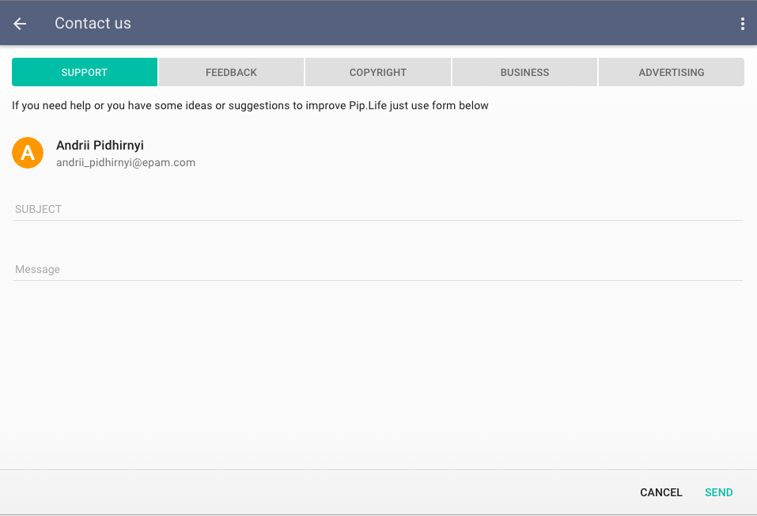

#  <br/> Product support pages


Maintaining bi-directional communication with users is critical for product success. It may include showing announces about 
new product releases, collecting feedback from users, conducting surveys to clarify users problems and needs.

Pip.WebUI.Support module implements pages to enable user support in Enterprise applications. In the current version it only
contains Feedback page. But there are plans to add more in the upcoming releases.

In Addition to open communication mechanisms, the module supports integration with Google Analytics to collect information on users behaviors in background.

### Users Feedback

The **Feedback** is available as a panel, that can be embedded into your custom page, as page and as dialog. It lets users to send to support team messages with their feedback, ideas or report various issues. It requires presence of **users** and **feedbacks** REST API.  

<a href="doc/images/img-feedback-page.png" style="border: 3px ridge #c8d2df; width: 50%; margin: auto; display: block">
    
</a>

### pipAnalytics service

The service allows to track user actions and reports them to Google Analytics. Page transitions are tracked automatically when **pipAnalytics** module is registered in the application. To track various events like clicks, scroll to certain position, etc. developer shall explicitely call **event** method.

```javascript
angular.module('myApp', [..., 'pipAnalytics']);
...
// Todo: show how to track events
```

## Learn more about the module

- [User's guide](doc/UsersGuide.md)
- [Online samples](http://webui.pipdevs.com/pip-webui-support/index.html)
- [API reference](http://webui-api.pipdevs.com/pip-webui-support/index.html)
- [Developer's guide](doc/DevelopersGuide.md)
- [Changelog](CHANGELOG.md)
- [Pip.WebUI project website](http://www.pipwebui.org)
- [Pip.WebUI project wiki](https://github.com/pip-webui/pip-webui/wiki)
- [Pip.WebUI discussion forum](https://groups.google.com/forum/#!forum/pip-webui)
- [Pip.WebUI team blog](https://pip-webui.blogspot.com/)

## <a name="dependencies"></a>Module dependencies

* [pip-webui-lib](https://github.com/pip-webui/pip-webui-lib): angular, angular material and other 3rd party libraries
* [pip-webui-css](https://github.com/pip-webui/pip-webui-css): CSS styles and web components
* [pip-webui-core](https://github.com/pip-webui/pip-webui-core): localization and other core services
* [pip-webui-rest](https://github.com/pip-webui/pip-webui-rest): REST resources for users and feedbacks
* [pip-webui-controls](https://github.com/pip-webui/pip-webui-controls): toggle buttons control
* [pip-webui-layouts](https://github.com/pip-webui/pip-webui-layouts): document layout
* [pip-webui-nav](https://github.com/pip-webui/pip-webui-nav): navigation dropdown
* [pip-webui-pictures](https://github.com/pip-webui/pip-webui-pictures): picture attachments
* [pip-webui-documents](https://github.com/pip-webui/pip-webui-documents): document attachments
* [pip-webui-composite](https://github.com/pip-webui/pip-webui-composite): content switch control

## <a name="license"></a>License

This module is released under [MIT license](License) and totally free for commercial and non-commercial use.
